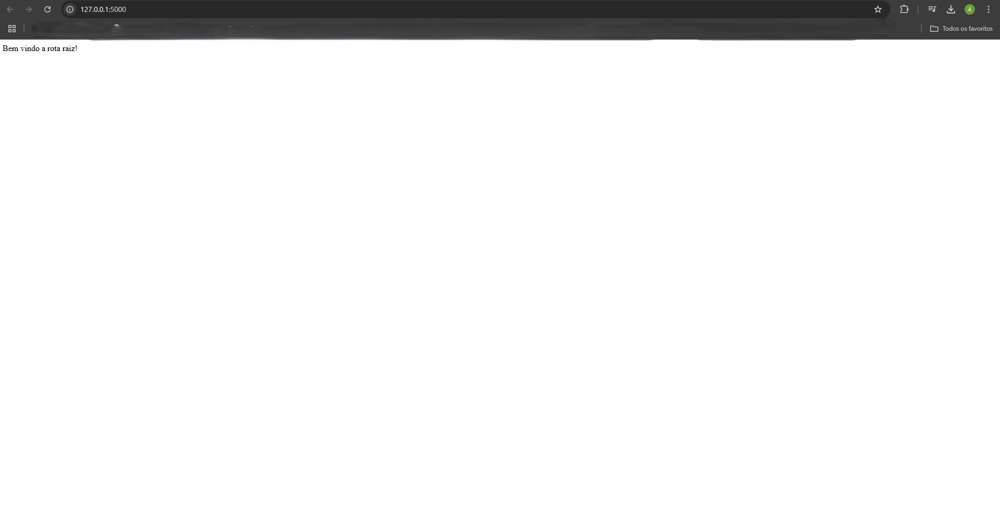
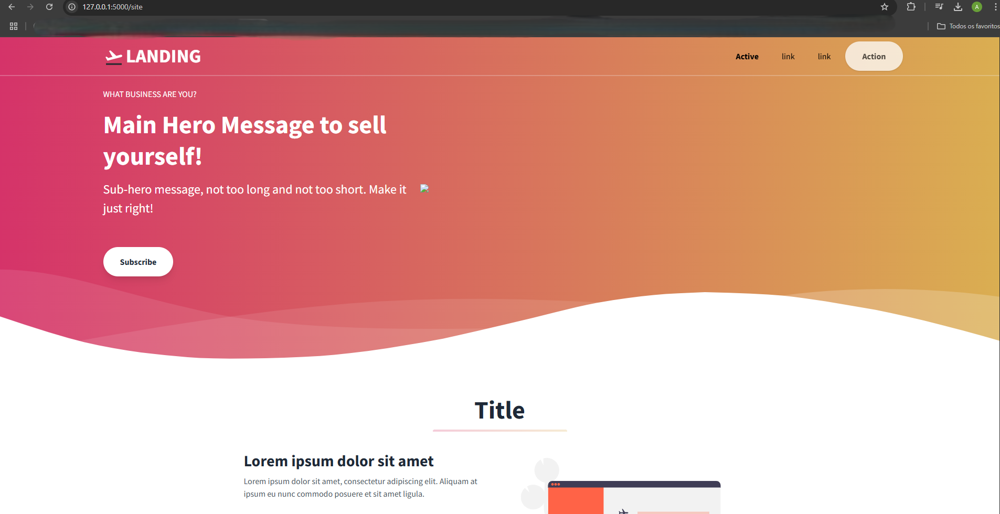

# Aplicações usando containers Docker

## #Tecnologias utilizadas

- Windows 11
- WSL 2.4.11.0
- Ubuntu 24.04 LTS
- Docker Desktop 4.39.0
- Docker Engine 28.0.1
- Docker Compose 2.33.1

1. Subindo a Landing Page TailwindCSS em um container NGINX
> [!IMPORTANT]
> Para sair de um container basta digitar `exit`.

<a src="https://github.com/tailwindtoolbox/Landing-Page/archive/master.zip">Link para download da Landing Page TailwindCSS<a>

* Abrir bash do Ubuntu (WSL) e digitar os comandos:

```
sudo su
(senha root)
apt-get update && apt-get upgrade -y
apt-get install zip -y
cd /
mkdir /desafios && cd desafios
mkdir desafio1 && cd desafio1
wget (Landing Page)
unzip master.zip
rm master.zip
mv Landing-Page-master site
cd site
rm README.md LICENSE
docker run --name tailwindcss-nginx -v ./:/usr/share/nginx/html:ro -d -p 80:80 nginx

```
* Copiar o ip do host (`ip a` - copiar o ip da interface de rede eth0), digitar no navegador http://iphost:80.

des1

2. Criando um contêiner Ubuntu com um script que atualiza os pacotes do contêiner Ubuntu ou imprime os logs

* Abrir bash do Ubuntu (WSL) e digitar os comandos:

```
cd /desafios && mkdir desafio2
cd desafio2 && mkdir script
cd script/ && vi script_ubuntu.sh
(Conteúdo do script, abaixo)
#!/bin/bash
if [ ! -e /var/log/syslog ]
then
        echo "Não foi possível encontrar o arquivo de log do sistema! Os pacotes serão atualizados."
        apt-get update && apt-get upgrade -y
        echo "Pacotes atualizados com sucesso!!!"
else
        echo "Logs do Ubuntu em tempo real(pressione CTRL C para sair):"
        tail -f /var/log/syslog
fi
(Tecla ESC):wq
chmod +x script_ubuntu.sh
docker run --name ubuntu_script -dti  ubuntu
docker cp script_ubuntu.sh ubuntu_script:/usr/bin
docker exec -it ubuntu_script bash
script_ubuntu.sh
```

3. Gerenciando containers em execução e parados.

* Listando containers em execução.`
 
`docker ps`

ger1

* Imprimindo as configurações detalhadas do container (rede, volumes, versão da imagem, entre outros).

`docker inspect nome_container ou id_container`

* Interrompendo/parando um container.

`docker stop nome_container ou id_container`

ger2

* Listando containers parados

`docker ps -a`

ger3

* Removendo um container parado.

`docker rm nome_container ou id_container`

ger4

* Removendo um container em execução.

`docker rm -f nome_container ou id_container`

ger5

4. Criando um Dockerfile para uma aplicação Flask acessando pelo endpoint (rotas).

<a src="./python/app.py">Código python</a>

<a src="./python/requirements.txt">requiments</a>

<a src="./Dockerfile_python/Dockerfile">Dockerfile</a>

* Abrir bash do Ubuntu (WSL) e digitar os comandos:

```
cd /desafios && mdkir desafio3
cd desafio3
mkdir templates && cp ../desafio1/site/index.html templates/
mkdir static && cp ../desafio1/site/hero.png static/
vi app.py

(inserir código python, salvar e sair)

vi requirements.txt

(inserir o conteúdo do arquivo requirements.txt, salvar e sair)

vi Dockerfile

(inserir código Dockerfile, salvar e sair)

docker build ./ -t flask_container
docker run --name app_flask -p 5000:5000 flask_container
```

* Clicar em qualquer link que aparecer, e testar as rotas "\" e "\site".





